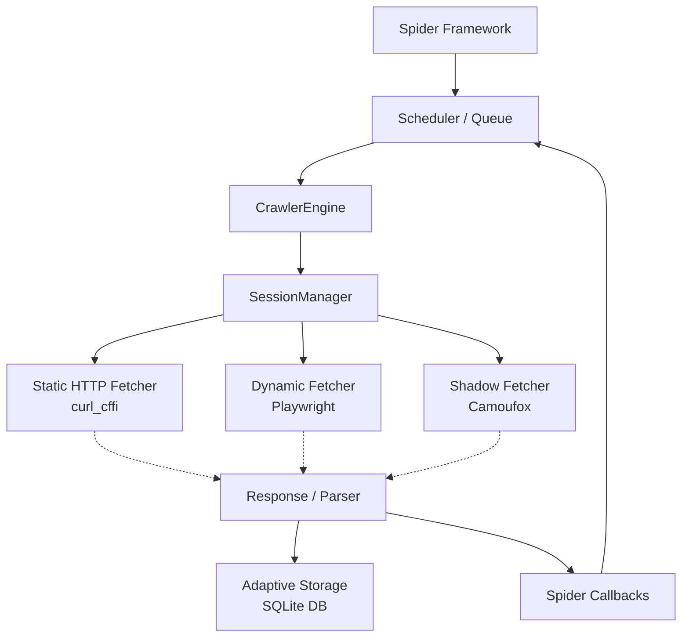

# WhisperCrawl Documentation Wiki

## Table of Contents

1. [Onboarding: Principal-Level Guide](#onboarding-principal-level-guide)
2. [Onboarding: Zero-to-Hero Learning Path](#onboarding-zero-to-hero-learning-path)
3. [Architecture Overview](#architecture-overview)
4. [Component Deep Dive](#component-deep-dive)
5. [Development & Workflow](#development--workflow)
6. [WhisperCrawl Skill (Agentic Capabilities)](#whispercrawl-skill-agentic-capabilities)

---

## Onboarding: Principal-Level Guide

### The Core Insight

WhisperCrawl is not just a scraper; it is an **adaptive, multi-strategy web scraping framework** designed to conquer the "bot defense arms race" while maintaining spidering concurrency modeled after Scrapy. The central design philosophy is that one fetching strategy does not fit all. Instead of relying purely on Playwright (heavy) or HTTP requests (blocked easily), WhisperCrawl introduces dynamic routing to `curl_cffi` (for HTTP/3 and TLS impersonation), `Playwright` (for JS-heavy sites), and `Camoufox` (for complex Cloudflare/Turnstile challenges).

_Mental Model / Pseudocode (TypeScript comparison):_

```typescript
interface Strategy {
  fetch(url): Response;
}
class StaticStealth implements Strategy {
  /* curl_cffi HTTP/3 */
}
class DynamicPlaywright implements Strategy {
  /* Chromium */
}
class ShadowCamoufox implements Strategy {
  /* Turnstile bypass */
}

// Routing is transparent to the Spider
class SpiderEngine {
  async process(req, strategy: Strategy) {
    const res = await strategy.fetch(req.url);
    yield * this.parse(res);
  }
}
```

### System Architecture



### Where to go deep?

1. **`whispercrawler/fetchers/shadow.py`**: Understand how Camoufox and humanization patterns (mouse movement delays, geo-ip integration) are applied to bypass heavy challenges.
2. **`whispercrawler/parser.py`**: Dive into the `Selector` class which features the `SQLiteStorageSystem` for self-healing adaptive parsing.
3. **`whispercrawler/spiders/engine.py`**: Look at how `anyio` manages asynchronous task groups for the Scrapy-like crawler engine.

---

## Onboarding: Zero-to-Hero Learning Path

### Part I: Foundations

**Python 3.10+ Async & Tools**

- **AsyncIO/AnyIO**: WhisperCrawl heavily leverages asynchronous patterns (`async`/`await`, `anyio` task groups) for high concurrency. (Compare to Javascript Promises or C# Tasks).
- **Type Annotations**: The project uses strict MyPy type checking with modern Union syntax (`str | bytes`).
- **Lxml**: Powers the DOM parsing, bypassing standard library constraints for extreme parsing speed.

### Part II: The Architecture

**The Fetchers (The Engine Room)**

- `requests.py`: Uses `curl_cffi` to mimic Chrome/Safari TLS fingerprints. Best for raw APIs or unprotected HTML.
- `chrome.py` & `stealth_chrome.py`: Uses Playwright. Re-uses browser pools and intercepts network requests to block unnecessary resources.
- `shadow.py`: The crown jewel using Camoufox for defeating advanced WAF systems like Cloudflare.

**The Parsers (The Intelligence)**

- Elements are extracted via CSS or XPath and wrapped in memory-efficient `Selector` objects (using `__slots__`).
- **Adaptive Recovery**: If a CSS selector (`.old-class-name`) fails because the site redesigned, the system refers to `elements_storage.db` to locate the element by similarity metrics from its past signature.

**The Spiders (The Operators)**

- Abstract class `Spider` orchestrates requests.
- Yielding a `Request` objects queues the exact URL back into the `Scheduler`, which enforces FIFO and deduplication using SHA-1 payload fingerprinting.

### Part III: Setup & Contributing

1. **Installation**:
   ```bash
   pip install -e ".[dev,fetchers,mcp]"
   whispercrawler install --force # Installs binaries for Playwright/Camoufox
   ```
2. **Quality Standards**:
   - Uses `pytest` with `pytest-asyncio`
   - Formatted by `ruff` (max line length 100)
   - Checked with `mypy` (strict)
3. **Testing Hook**: Run `pytest whispercrawler/tests/ -v --tb=short` to execute the full suite.

---

## Architecture Overview

### Checkpointing System

An advanced `Pickle`-based checkpoint mechanism exists under `whispercrawler/spiders/checkpoint.py`. It persists the target queue, `Scheduler` states, and deduplication hashes to disk, ensuring a large crawl spanning thousands of pages can resume immediately after interruption.

### ProxyWheel

Located in `whispercrawler/proxy.py`, the `ProxyWheel` handles thread-safe rotation for bypassing IP rate limits.

- Supports `round_robin`, `random`, and `least_used` scheduling.
- Implements a 5-minute quarantine logic for proxies that begin returning 403s, 502s, or timeouts.

### Model Context Protocol (MCP) Server

`whispercrawler/mcp_server.py` turns the entire extraction capability into programmatic endpoints accessible by Large Language Models or other agentic frameworks. It directly maps high-level intents like `ghost_crawl` to the underlying Playwright engine, returning serialized representations in JSON.

---

## Component Deep Dive

### 1. `parser.py` (Core Extraction)

- **`Selector`**: Uses `__slots__` for a 40% memory reduction compared to generic dict-based objects. Supports chaining with methods like `siblings`, `parent`, or `find_similar()`.
- **`TextHandler` & `AttributesHandler`**: Custom wrappers around standard types that allow fluent, chainable JSON dumps or type coercion.

### 2. `fetchers/requests.py` vs `fetchers/shadow.py`

- `curl_cffi` acts as a C-binding for blazing fast HTTP/3. This is memory light and extremely fast.
- `shadow.py` utilizes heavy runtime binaries. Mouse jitter algorithms (`random.randint` and small `time.sleep` intervals) trick behavioral analytics.

### 3. `spiders/scheduler.py`

- Inherits from `asyncio.PriorityQueue`.
- Combines depth limits, deduplication hashing (combining Method, Headers, and Body), and ensures we don't fetch identical resource URIs unless explicitly bypasses.

---

## Development & Workflow

### Conventions

1. **Imports**: Keep Standard Library -> Third-Party -> Local imports separate.
2. **Exceptions**: Always chain exceptions (`raise NewException() from e`) for clean tracebacks.
3. **Slots**: Utilize `__slots__` when creating new models representing large lists of nodes (like scraped rows).

### Debugging Options

Drop into the interactive testing environment:

```bash
whispercrawler shell --loglevel info
```

This is specifically useful for testing DOM CSS selectors locally without running the full test suite.

---

## WhisperCrawl Skill (Agentic Capabilities)

The `whispercrawler-skill` directory provides a ready-to-use AgentSkill (aligning with the [AgentSkill specification](https://agentskills.io/specification)) designed for integration with agentic tools and LLM frameworks such as OpenClaw and Claude Code. Embodying our goal of comprehensive automation, this skill distills technical documentation into an AI-readable format, empowering agents to autonomously understand, implement, and orchestrate WhisperCrawl.

### Key Aspects
- **AI-Native Context:** Encapsulates the core logic, usage patterns, references (`examples`, `references`), and configurations specifically structured for agents.
- **Problem Resolution:** Designed to autonomously answer ~90% of development and architectural questions regarding the framework.

### Integration
- **Clawhub:** You can install the skill using OpenClaw via:
  ```bash
  clawhub install whispercrawler-official
  ```
- **Direct Zip:** Integrate directly by downloading the package from the main branch.

This bridge enables a smoother development experience when pairing with agentic coders, removing the burden of manual context-passing and allowing seamless orchestration of WhisperCrawl's stealth routing mechanisms.
